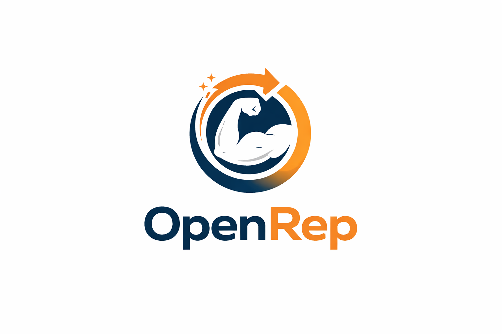

  

# OpenRep

Training your body shouldn't depend on hidden systems you don't understand or expensive apps you can't control.

Most workout apps are closed, generic, and built around business models, not people. OpenRep is different. It's open source, so anyone can see how workouts are generated, improve them, and adapt them to real needs. Good training knowledge shouldn't be locked away. It should be shared, transparent, and accessible to everyone.

## Features

- Generate personalized workouts based on your goals, equipment, fitness level, and available time
- Browse and filter over 160 exercises by muscle group, difficulty, and equipment type
- View exercise details with images and video links
- Save and manage workout plans
- Track your training sessions
- Add your own custom exercises

## Tech stack

- Kotlin + Jetpack Compose
- Room (local database)
- Hilt (dependency injection)
- Retrofit + Moshi (networking)
- Coil (image loading)
- MVVM with StateFlow

## Contributing

Contributions are welcome. Whether it's a bug fix, a new exercise, an improvement to the workout logic, or a translation, feel free to open a pull request.

1. Fork the repository
2. Create a branch for your change
3. Open a pull request

## Credits

Exercise images are provided by [free-exercise-db](https://github.com/yuhonas/free-exercise-db), an open source exercise image library by yuhonas.

## License

MIT
